# System Architecture Overview

**Project:** Job Hunter AI Agent  
**Status:** Phase 1 (MVP) — ✅ Complete | Phase 2 (Auto-Apply) — 🔲 Not Started  
**Last Updated:** 2026-04-05 (ENH-003, ENH-004, ENH-005, ENH-006, TD-004, regression fixes applied)

---

## 1. Purpose & Scope

The Job Hunter Agent is a **local Python AI agent** that eliminates the manual effort of job hunting on Indian job platforms. Given a resume and a config file, it independently discovers relevant jobs, scores them against the user's profile, and exports a structured, ranked shortlist to CSV — all without any manual search input from the user.

This document covers the complete system architecture for Phase 1 (MVP — complete), Phase 2 (Auto-Apply — planned), and beyond.

---

## 2. Technology Stack

| Layer | Technology | Purpose |
|-------|-----------|---------|
| **Language** | Python 3.11+ | Runtime |
| **Orchestration** | [LangGraph](https://langchain-ai.github.io/langgraph/) | Stateful pipeline execution |
| **Browser Automation** | [Playwright](https://playwright.dev/) | Naukri scraping & (Phase 2) auto-apply |
| **LLM — Primary** | Groq (`llama-3.3-70b-versatile`) | Resume parsing |
| **LLM — Fallback** | OpenAI (`gpt-4o`) | Resume parsing fallback on rate limit |
| **Data Validation** | Pydantic v2 | Config, profile, and state schemas |
| **Config Format** | YAML | User preferences and search config |
| **Output Format** | CSV | Job shortlist export |
| **CLI** | Click + Rich | User-facing terminal interface |
| **Package Manager** | UV | Dependency management |

---

## 3. Repository Structure

```
job-hunter/
├── src/job_hunter/          # Core application package
│   ├── cli.py               # CLI entry point (Click commands)
│   ├── config.py            # Config loading, validation, interactive prompts
│   ├── browser.py           # BrowserManager (Playwright session lifecycle)
│   ├── graph/
│   │   ├── state.py         # LangGraph state schema (JobHunterState)
│   │   ├── nodes.py         # Pipeline node functions
│   │   └── workflow.py      # StateGraph definition and compilation
│   ├── resume/
│   │   ├── schema.py        # ResumeProfile Pydantic model
│   │   └── parser.py        # LLM-based resume extraction + caching
│   ├── search/
│   │   └── naukri.py        # Playwright-based Naukri DOM scraper
│   ├── scoring/
│   │   └── engine.py        # Weighted rubric scoring engine
│   ├── export/
│   │   └── csv_export.py    # CSV writer with full MVP schema
│   └── llm/
│       └── provider.py      # LLM abstraction (Groq primary + OpenAI fallback)
├── config/
│   └── user.yaml            # User profile, search config, scoring thresholds
├── data/
│   ├── profile.json         # Cached parsed profile (persisted between runs)
│   └── run_history.json     # Tracks last run timestamps for freshness auto-calculation
├── output/
│   └── shortlist_*.csv      # Timestamped CSV exports (one per run)
├── resume.pdf               # User's resume file (root-level convention)
└── specs/                   # Spec-driven project management
```

---

## 4. Core Concepts

### 4.1 Shared Pipeline State (`JobHunterState`)

The entire pipeline is powered by a single TypedDict that LangGraph threads through every node:

```python
class JobHunterState(TypedDict):
    config: AppConfig          # Full user config
    resume_path: str           # Path to resume file
    profile: ResumeProfile     # Structured profile extracted from resume
    raw_jobs: list[JobListing] # All scraped jobs (before scoring)
    scored_jobs: list[ScoredJob]       # All jobs with scores
    shortlisted_jobs: list[ScoredJob]  # Jobs above threshold
    csv_path: str              # Output path for CSV
    browser_page: Any          # Live Playwright Page injected at startup
```

### 4.2 Config Schema (`AppConfig`)

User intent is driven entirely by `config/user.yaml`, parsed into a Pydantic model:

```
AppConfig
├── Profile         — name, experience, target roles, salary, locations
├── SearchConfig    — platforms, salary range, experience filter, freshness, max_roles, max_locations, max_jobs, work_mode_filter, job_types, excluded_companies, excluded_keywords, delay_min/max_seconds
├── ScoringConfig   — shortlist_threshold (default 60), apply_threshold (default 75)
├── ScreeningAnswers — willing_to_relocate, current_ctc, expected_ctc, notice_period, reason_for_change, visa_status, remote_work_preference + 10 new fields for Phase 2
└── AutoApplyConfig — enabled, max_per_day, max_per_run, delay_between_seconds, require_confirmation, skip_if_already_applied (Phase 2)
```

### 4.3 Job Data Schemas

**`JobListing`** — raw scraped data:
`title`, `company`, `location`, `work_mode`, `experience_required`, `salary_lpa`, `job_url`, `job_id`, `description`, `posted_date`, `job_board`

**`ScoredJob`** — enriched with scoring results:
`job` (JobListing), `match_score`, `matched_skills`, `why_selected`, `apply_status`

---

## 5. Execution Pipeline

### 5.1 Startup (outside LangGraph)

Before the graph begins, the CLI performs two synchronous setup steps:

1. Loads config via `load_config(config_path)` 
2. Initialises `BrowserManager`, calls `browser.start()` and `browser.login_naukri()` to authenticate a persistent Playwright session

The authenticated `page` object is injected into `initial_state["browser_page"]` so all scraping nodes inside the graph can reuse the same session.

### 5.2 LangGraph Pipeline (Linear StateGraph)

```
load_config → parse_resume → search_jobs → score_jobs → filter_shortlist → export_csv → END
```



```mermaid
graph LR
    CLI[CLI: job-hunter run] -->|loads config + starts browser| S((State))
    S --> N1[1. load_config]
    N1 -->|validate + prompt missing fields| N2[2. parse_resume]
    N2 -->|LLM extraction or cache hit| N3[3. search_jobs]
    N3 -->|Playwright DOM scrape| N4[4. score_jobs]
    N4 -->|weighted rubric| N5[5. filter_shortlist]
    N5 -->|threshold filter + top-N| N6[6. export_csv]
    N6 --> OUT[output/shortlist_*.csv]
```

### Node Responsibilities

| Node | Input | Output | Key Logic |
|------|-------|--------|-----------|
| `load_config` | `config` | `profile_validated = True` | Validates required fields; prompts interactively for any missing ones; saves answers back to `user.yaml` |
| `parse_resume` | `resume_path` | `profile` | Checks `data/profile.json` cache first; if stale/absent, calls LLM via `parser.py`; persists new profile to disk |
| `search_jobs` | `profile`, `browser_page` | `raw_jobs` | Builds search queries from profile (roles × skills × locations); scrapes Naukri; deduplicates within-run AND across past CSV exports |
| `score_jobs` | `raw_jobs`, `profile` | `scored_jobs` | Applies 6-factor weighted rubric; generates human-readable `why_selected`; sets `apply_status` |
| `filter_shortlist` | `scored_jobs` | `shortlisted_jobs` | Filters jobs ≥ `shortlist_threshold`; sorts descending by score; respects `max_jobs` cap |
| `export_csv` | `shortlisted_jobs` | `csv_path` | Writes MVP schema CSV to `output/shortlist_<timestamp>.csv` |

---

## 6. Module Deep-Dives

### 6.1 Resume Parser (`resume/parser.py`)

**Strategy:** LLM-first extraction with local caching.

1. If `data/profile.json` exists → load and return immediately (no LLM call).
2. Otherwise, extract text from the resume file (supports `.pdf`, `.docx`, `.txt`).
3. Invoke the LLM with a strict structured prompt demanding a JSON response.
4. Parse the JSON into a `ResumeProfile` Pydantic model.
5. Persist to `data/profile.json` for future runs.

**Extracted fields:** name, email, phone, skills, tech\_stack, total\_experience\_years, past\_roles, industry\_domain, location\_preference, salary\_expectation, target\_roles, education, summary.

### 6.2 LLM Provider (`llm/provider.py`)

A singleton `LLMProvider` class with automatic primary-to-fallback switching:

- **Primary:** Groq (`llama-3.3-70b-versatile`) — fast and free tier available
- **Fallback:** OpenAI (`gpt-4o`) — auto-switches on `rate_limit`, `429`, `quota`, or `overloaded` errors
- Credentials loaded from `.env` via `GROQ_API_KEY` / `OPENAI_API_KEY`

### 6.3 Browser Manager (`browser.py`)

A `BrowserManager` class manages the Playwright session lifecycle:

- Launches Chromium (non-headless by default — improves Naukri success rate).
- Sets anti-bot evasion headers: disables `webdriver` property, spoofs plugins/languages, sets `en-IN` locale and `Asia/Kolkata` timezone.
- `login_naukri()` reads `NAUKRI_EMAIL` / `NAUKRI_PASSWORD` from `.env`, fills the login form, and verifies redirect from the login page.
- The `Page` object is returned and injected directly into the LangGraph state for shared use across all scraping calls.

### 6.4 Naukri Scraper (`search/naukri.py`)

**Search Query Generation:**
- Uses configurable `max_roles` (default 5) and `max_locations` (default 3) from SearchConfig.
- Generates role-only queries (no skill suffix): e.g., "Technical Lead in Bangalore".
- If no locations configured, uses role-only query with empty location.
- No arbitrary query cap — all role × location combinations are searched.

**Page Scraping:**
- Freshness filtering: Uses `jobAge=N` param in URL (not `dd` which only sorts): `naukri.com/<keyword>-jobs?k=<keyword>&jobAge=<days>`
- Respects `config.search.freshness` (0=auto, 1/3/7/15/30 days).
- Auto-calculation: If freshness=0, calculates from last run timestamp in `data/run_history.json`.
- Attempts 7 progressive selector strategies to find job cards (resilient to DOM changes).
- Extracts: title, company, location, description, salary, experience, posted date, apply URL.
- **Skills extraction:**
  1. **Primary:** Extracts from `.row5` or `.tags` div on Naukri listing page — where Naukri displays key skills per job card.
  2. **Fallback:** If row5 not found, scans job description for user's own skills using word-boundary regex (`\b<skill>\b`). No static keyword list — only matches skills the user actually has.
- Scrolls down 2-4 times (randomized) to trigger lazy-loaded results.
- Caps results per query at `max_jobs_per_query` (default: 100).
- **Anti-blocking:** All delays randomized with `random.uniform()`:
  - Page load wait: 2-5 seconds
  - Between scrolls: 1.5-3 seconds
  - Between queries: `delay_min_seconds` to `delay_max_seconds` (default 3-8s)
  - Scroll distance: random 400-800px

**Within-run Deduplication:** fingerprint = MD5(`title|company`).

**Cross-run Deduplication:** before scoring, reads all existing `output/shortlist_*.csv` files and pre-populates the `seen` fingerprint set with `MD5(job_title|company|location)` from past runs — preventing the same job from appearing in multiple run outputs.

### 6.5 Scoring Engine (`scoring/engine.py`)

Each job is scored on a **0–100 composite score** using a weighted rubric:

| Factor | Weight | Logic |
|--------|--------|-------|
| Skills match | **30%** | Matches profile's tech skills vs. job's `required_skills` field (or description keyword scan); uses fuzzy substring matching with false-positive guards (e.g., java ≠ javascript) |
| Experience match | **20%** | Matches user years vs. job range; penalises mismatch linearly |
| Role title match | **20%** | Exact → word overlap → keyword match with target + past roles |
| Keywords similarity | **15%** | Bag-of-words overlap between profile skills/stack and full job text |
| Salary match | **8%** | Compares job's min salary vs. expected CTC; partial credit for ≥80% of expectation |
| Location match | **0%** | *(Intentionally zeroed out in current implementation — see known gap below)* |

**Output per job:**
- `match_score` (0–100 composite)
- `matched_skills` (list of aligned skills)
- `why_selected` (human-readable bullet summary)
- `apply_status`: `"Pending"` if score ≥ `apply_threshold`, else `"Skipped"`

### 6.6 CSV Export (`export/csv_export.py`)

Writes `output/shortlist_<YYYYMMDD_HHMMSS>.csv` with the full MVP column schema:

`job_title`, `company`, `job_board`, `location`, `work_mode`, `experience_required`, `salary_lpa`, `match_score`, `matched_skills`, `why_selected`, `job_url`, `posted_date`, `job_description`, `apply_status`, `data_source`

---

## 7. Data Flow Summary

```
resume.pdf          config/user.yaml
     │                    │
     ▼                    ▼
[parse_resume]     [load_config]
     │                    │
     └──── ResumeProfile ─┘
                 │
                 ▼
         [search_jobs]  ←── Playwright session (login → scrape Naukri)
                 │           ↑
                 │     Dedup: within-run (title|company) +
                 │            cross-run (scan output/*.csv)
                 │
                 ▼
         [score_jobs]   ←── 6-factor weighted rubric
                 │
                 ▼
       [filter_shortlist]  ←── score ≥ threshold, sorted, top-N
                 │
                 ▼
          [export_csv]
                 │
                 ▼
    output/shortlist_*.csv
```

---

## 8. Phase 2 Architecture Outlook (Auto-Apply)

Phase 2 extends the pipeline without changing its core architecture:

1. **New nodes added to the StateGraph:**
   - `auto_apply_node` — iterates over `shortlisted_jobs` where `apply_status == "Pending"` and score ≥ `apply_threshold`
   - `smart_qa_node` — answers screening questions using config `screening_answers` first, then LLM fallback

2. **Browser session reuse:** The `browser_page` already lives in `JobHunterState`, so apply nodes can navigate directly to `job.job_url` without any new session setup.

3. **CSV write-back:** The `apply_status` column (`Applied`, `Failed`, `Already Applied`) will be updated in-place after each apply attempt.

4. **Multi-platform support:** The `search_jobs` node's platform dispatch loop (`for platform in config.search.platforms`) is already written — adding LinkedIn, Hirist, Instahyre requires only new scraper modules.

5. **Company intelligence:** New enrichment columns (`company_size`, `glassdoor_rating`, `core_business`) appended to the CSV schema.

---

## 9. Security & Anti-bot Considerations

- **Credentials:** Naukri login and LLM API keys stored in `.env` only — never committed.
- **Anti-bot measures:** 
  - Chromium launched with `AutomationControlled` disabled; `webdriver` navigator property spoofed; human-like `locale`, `timezone`, and plugin count set.
  - **Randomized timing:** All sleeps use `random.uniform()` instead of fixed values.
  - Randomized scroll count (2-4) and distance (400-800px).
  - Configurable delay between queries (`delay_min_seconds`, `delay_max_seconds`).
- **Rate limit handling:** LLM provider auto-switches from Groq to OpenAI on 429 errors.
- **Scraper fragility:** Naukri DOM changes will break selectors. The scraper uses 7 progressive selector strategies to maximise resilience but must be treated as a maintainable layer.

---

## 10. Smart Freshness (ENH-004)

The pipeline auto-calculates the optimal freshness window based on run history:

- `config.search.freshness` = 0 → auto-calculate from last run
- `config.search.freshness` = 1/3/7/15/30 → use explicit value, minimum with auto

**Auto-calculation logic:**
1. Load `data/run_history.json` — tracks last run timestamp per platform.
2. Calculate `days_since = (now - last_run).days`
3. Map to smallest Naukri `jobAge` value >= days_since
4. Example: 2 days ago → jobAge=3, 5 days ago → jobAge=7

**First run:** No history → defaults to jobAge=7 (past week).
